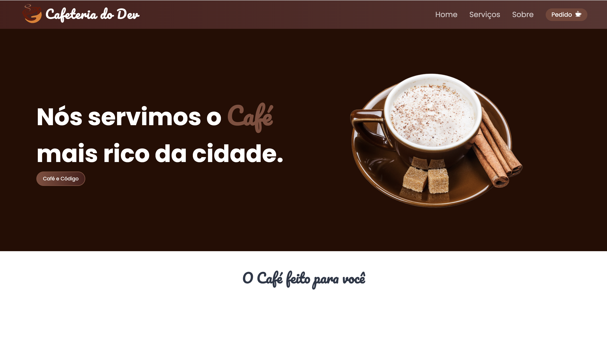
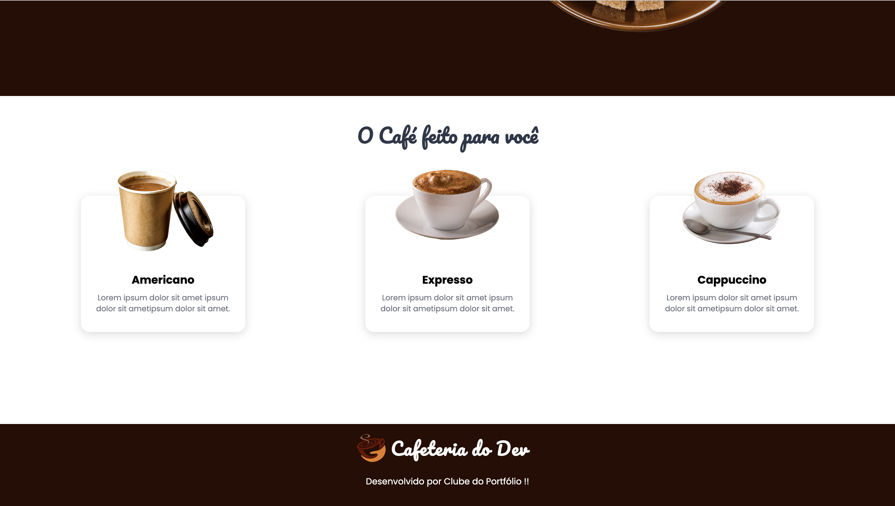
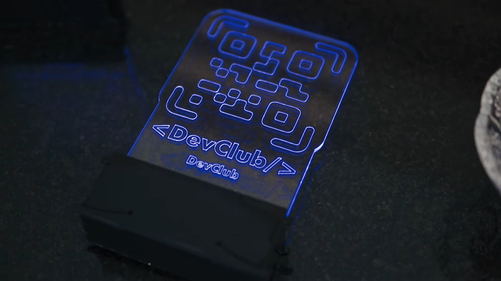

<h1>Cafeteria do Dev</h1>
 

> Home Page
>   

 

> Services Page
>   

 

> <h3>Descrição do projeto</h3>

 

O projeto 'Cafeteria do Dev' é uma aplicação web desenvolvida utilizando HTML, CSS e JavaScript. Nosso principal objetivo é entregar um projeto bonito e funcional para o nosso cliente, adaptado a qualquer tipo de tela.

---

  

 <h2>Programadores:</h2>

  

<table>
  <tr>
      <td align="center">
          <a href="#">
                 
                
                <b>Teacher Isaque e alunos</b>
                
         </a>
      </td>
  </tr>
</table>
